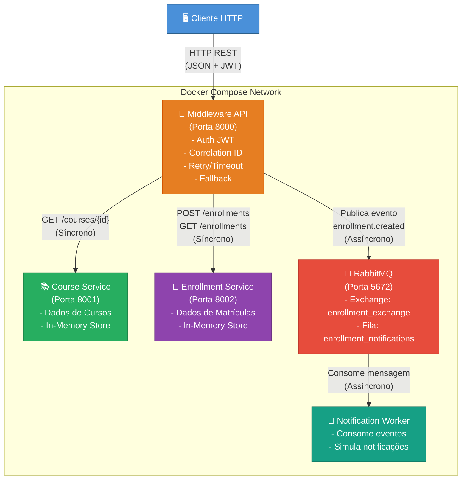

# Arquitetura do Sistema

## Visão Geral

O sistema de matrícula é construído sobre uma **arquitetura distribuída baseada em middleware**, onde um gateway central (Middleware API) orquestra a comunicação entre serviços independentes. Essa abordagem promove o desacoplamento, a escalabilidade e a resiliência do sistema como um todo.

A arquitetura segue os seguintes princípios:

- **Separação de responsabilidades**: cada serviço possui um domínio bem definido
- **Comunicação híbrida**: combinação de chamadas síncronas (REST/HTTP) e assíncronas (RabbitMQ)
- **Resiliência**: mecanismos de timeout, retry e fallback para lidar com falhas
- **Observabilidade**: correlation IDs para rastreamento de requisições e métricas do sistema

---

## Componentes do Sistema

### 1. Middleware API (Porta 8000)

O Middleware API é o **ponto de entrada único** do sistema. Ele atua como um gateway que centraliza a lógica de orquestração, autenticação e resiliência.

**Responsabilidades:**

- **Gateway**: recebe todas as requisições dos clientes e as encaminha para os serviços apropriados
- **Autenticação e Autorização**: valida tokens JWT e verifica permissões baseadas em roles (`student`, `admin`)
- **Correlation ID**: gera e propaga identificadores únicos (`X-Correlation-ID`) para rastreamento de requisições através de todos os serviços
- **Resiliência**: implementa padrões de timeout (5s), retry (3 tentativas com backoff exponencial) e fallback para chamadas HTTP
- **Publicação de Eventos**: publica eventos no RabbitMQ após operações bem-sucedidas (ex.: `enrollment.created`)
- **Métricas**: expõe endpoint `/metrics` com estatísticas do sistema

### 2. Course Service (Porta 8001)

Serviço responsável pelo gerenciamento dos dados de cursos.

**Responsabilidades:**

- Armazena e gerencia informações de cursos (nome, descrição, instrutor, vagas)
- Fornece endpoints REST para consulta de cursos
- Utiliza **armazenamento em memória** (dicionário Python) para simplicidade

**Dados pré-carregados:**

| ID | Curso | Instrutor |
|----|-------|-----------|
| CS101 | Introdução à Computação | Prof. Silva |
| CS201 | Estruturas de Dados | Prof. Santos |
| CS301 | Engenharia de Software | Prof. Oliveira |

### 3. Enrollment Service (Porta 8002)

Serviço responsável pelo gerenciamento das matrículas dos alunos.

**Responsabilidades:**

- Cria e armazena registros de matrículas
- Lista todas as matrículas registradas
- Gera IDs únicos para cada matrícula (UUID)
- Utiliza **armazenamento em memória** (lista Python) para simplicidade

### 4. RabbitMQ (Porta 5672 / 15672)

Broker de mensagens que habilita a **comunicação assíncrona** entre o Middleware e o Notification Worker.

**Responsabilidades:**

- Recebe eventos publicados pelo Middleware API
- Enfileira mensagens na fila `enrollment_notifications`
- Garante a entrega de mensagens ao Notification Worker
- Interface de gerenciamento acessível na porta 15672 (guest/guest)

**Exchange e Fila:**

- **Exchange**: `enrollment_exchange` (tipo: direct)
- **Routing Key**: `enrollment.created`
- **Fila**: `enrollment_notifications`

### 5. Notification Worker

Serviço consumidor que processa eventos de forma assíncrona.

**Responsabilidades:**

- Consome mensagens da fila `enrollment_notifications`
- Simula o envio de notificações (e-mail, SMS, push) via log no console
- Opera de forma independente dos demais serviços
- Reconecta automaticamente ao RabbitMQ em caso de falha na conexão

---

## Padrões de Comunicação

### Comunicação Síncrona (REST/HTTP)

Utilizada para operações que exigem resposta imediata:

```
Cliente → Middleware API → Course Service (GET /courses/{id})
Cliente → Middleware API → Enrollment Service (POST /enrollments)
Cliente → Middleware API → Enrollment Service (GET /enrollments)
```

**Características:**

- Protocolo HTTP com formato JSON
- Headers de rastreamento (`X-Correlation-ID`)
- Timeouts de 5 segundos por chamada
- Retry com backoff exponencial em caso de falha

### Comunicação Assíncrona (RabbitMQ)

Utilizada para operações que não exigem resposta imediata:

```
Middleware API → RabbitMQ → Notification Worker
```

**Características:**

- Publicação do evento `enrollment.created` após matrícula bem-sucedida
- Processamento assíncrono pelo Worker (fire-and-forget do ponto de vista do Middleware)
- Desacoplamento total entre o Middleware e o Worker
- Se o RabbitMQ estiver indisponível, a matrícula ainda é realizada (degradação graciosa)

---

## Diagrama da Arquitetura



---

## Decisões de Projeto e Justificativas

### 1. Armazenamento em Memória

**Decisão**: Utilizar dicionários e listas Python em vez de banco de dados.

**Justificativa**: O foco do projeto é demonstrar padrões de arquitetura distribuída (middleware, comunicação síncrona/assíncrona, resiliência), não persistência de dados. O armazenamento em memória simplifica o setup e permite focar nos conceitos arquiteturais.

### 2. Gateway Centralizado (Middleware)

**Decisão**: Um único ponto de entrada que orquestra todas as chamadas.

**Justificativa**: Centraliza concerns transversais (autenticação, logging, resiliência) em um único local, evitando duplicação de lógica nos serviços internos. Os serviços internos ficam mais simples e focados em suas responsabilidades de domínio.

### 3. Comunicação Híbrida (Síncrona + Assíncrona)

**Decisão**: REST para consultas e operações que requerem resposta imediata; RabbitMQ para notificações.

**Justificativa**: Notificações não precisam bloquear o fluxo principal da matrícula. Se o RabbitMQ estiver fora do ar, a matrícula deve ser concluída normalmente — a notificação é um efeito colateral, não uma operação crítica.

### 4. JWT Simplificado

**Decisão**: Tokens JWT com verificação simplificada (sem expiração rigorosa em ambiente de desenvolvimento).

**Justificativa**: Demonstra o conceito de autenticação baseada em tokens sem a complexidade de um servidor de autenticação completo (como OAuth2/OIDC).

### 5. Docker Compose

**Decisão**: Utilizar Docker Compose para orquestração de todos os serviços.

**Justificativa**: Garante reprodutibilidade do ambiente, facilita o startup/shutdown de todos os serviços e simula um ambiente distribuído real em uma máquina local.

### 6. Eventual Consistency para Notificações

**Decisão**: A notificação é processada de forma eventualmente consistente.

**Justificativa**: O padrão de consistência eventual é adequado para notificações, pois pequenos atrasos são aceitáveis. Isso permite que o sistema principal mantenha alta disponibilidade mesmo quando o sistema de notificações está indisponível.
