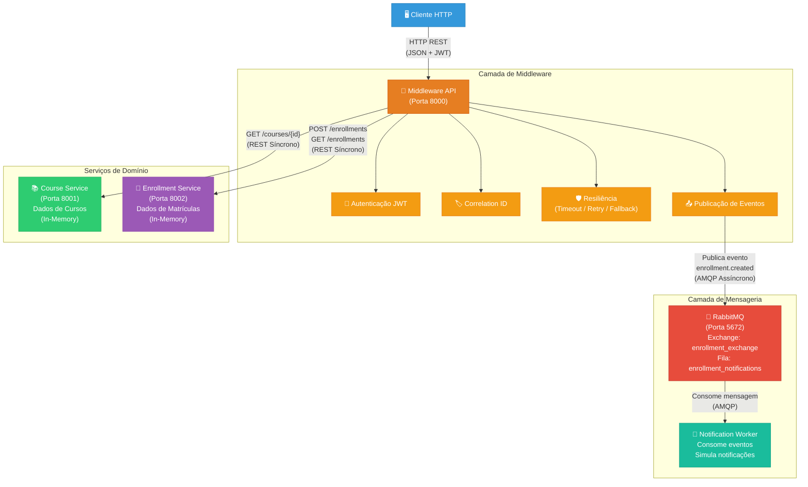
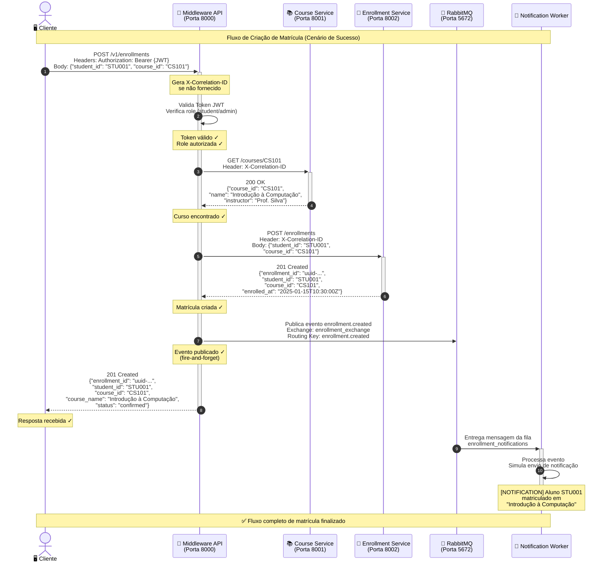
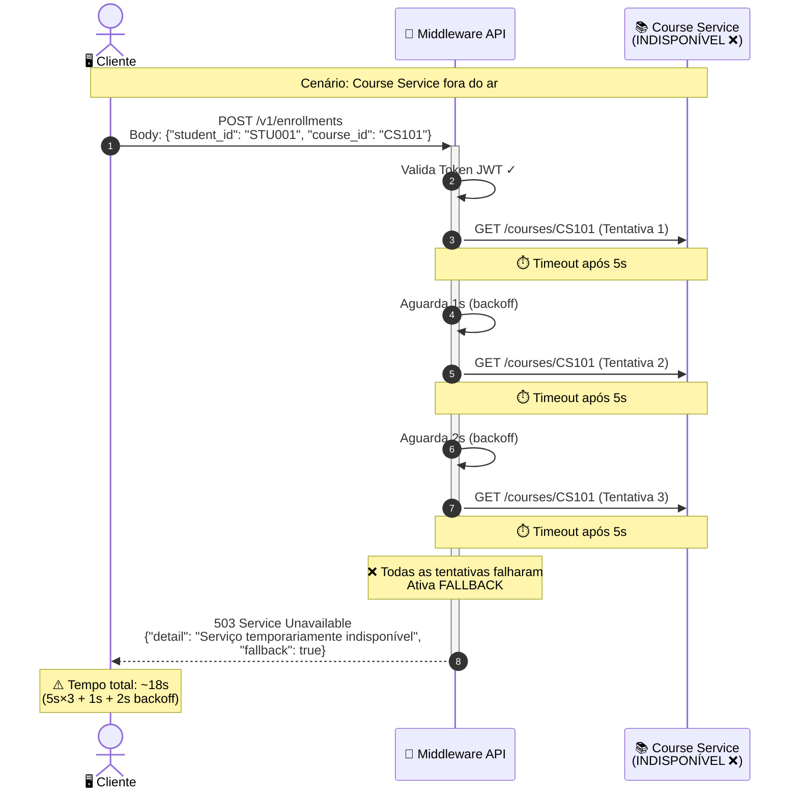
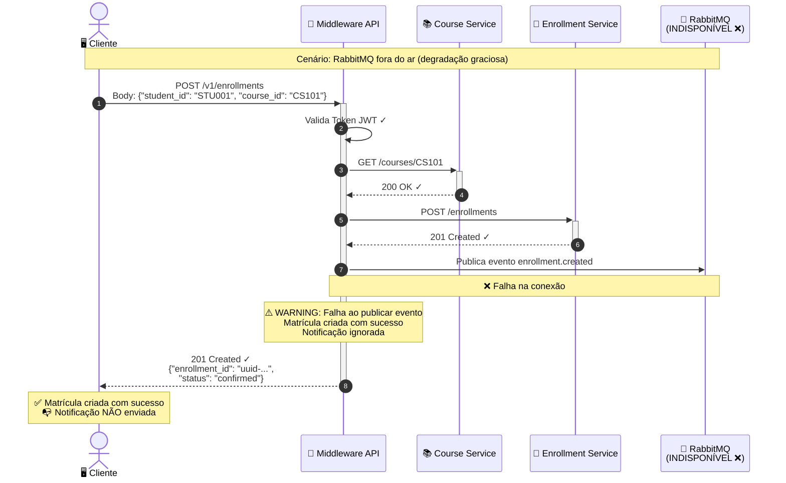

# Diagramas da Arquitetura

Este documento contém os diagramas visuais da arquitetura do sistema de matrícula, apresentados em diferentes formatos para facilitar a compreensão.

---

## 1. Diagrama ASCII

Visão geral da arquitetura em formato texto:

```
┌──────────────────────────────────────────────────────────────────────┐
│                        SISTEMA DE MATRÍCULA                         │
│                    Arquitetura de Middleware                         │
└──────────────────────────────────────────────────────────────────────┘

                          ┌─────────────┐
                          │   CLIENTE   │
                          │  (HTTP/REST)│
                          └──────┬──────┘
                                 │
                                 │ HTTP Request
                                 │ (JWT Token)
                                 ▼
                    ┌────────────────────────────┐
                    │      MIDDLEWARE API         │
                    │       (Porta 8000)          │
                    │                            │
                    │  • Autenticação JWT        │
                    │  • Correlation ID          │
                    │  • Timeout (5s)            │
                    │  • Retry (3x, backoff)     │
                    │  • Fallback                │
                    │  • Publicação de Eventos   │
                    │  • Métricas                │
                    └──┬──────────┬──────────┬───┘
                       │          │          │
            ┌──────────┘          │          └──────────┐
            │ REST/HTTP           │ REST/HTTP           │ AMQP
            │ (Síncrono)          │ (Síncrono)          │ (Assíncrono)
            ▼                     ▼                     ▼
  ┌──────────────────┐ ┌──────────────────┐  ┌──────────────────┐
  │  COURSE SERVICE  │ │ENROLLMENT SERVICE│  │    RABBITMQ      │
  │   (Porta 8001)   │ │   (Porta 8002)   │  │   (Porta 5672)   │
  │                  │ │                  │  │                  │
  │ • GET /courses/  │ │ • POST /enroll.  │  │ • Exchange:      │
  │   {course_id}    │ │ • GET /enroll.   │  │   enrollment_    │
  │ • In-Memory      │ │ • In-Memory      │  │   exchange       │
  │   Store          │ │   Store          │  │ • Fila:          │
  │                  │ │                  │  │   enrollment_    │
  │                  │ │                  │  │   notifications  │
  └──────────────────┘ └──────────────────┘  └────────┬─────────┘
                                                      │
                                                      │ Consome
                                                      │ mensagens
                                                      ▼
                                            ┌──────────────────┐
                                            │ NOTIFICATION     │
                                            │ WORKER           │
                                            │                  │
                                            │ • Consome eventos│
                                            │ • Simula envio   │
                                            │   de notificações│
                                            │ • Log no console │
                                            └──────────────────┘

┌──────────────────────────────────────────────────────────────────────┐
│ LEGENDA:                                                            │
│   ──────►  Comunicação Síncrona (REST/HTTP)                         │
│   ══════►  Comunicação Assíncrona (AMQP/RabbitMQ)                   │
│   [    ]   Serviço containerizado (Docker)                          │
└──────────────────────────────────────────────────────────────────────┘
```

---

## 2. Diagrama de Fluxo (Mermaid)

Visão geral da arquitetura mostrando todos os componentes e suas interações:



---

## 3. Diagrama de Sequência — Fluxo de Matrícula (Mermaid)

Diagrama detalhado mostrando o fluxo completo de uma matrícula bem-sucedida, passo a passo:



---

## 4. Diagrama de Sequência — Cenário de Falha (Course Service Indisponível)



---

## 5. Diagrama de Sequência — Cenário de Falha (RabbitMQ Indisponível)


